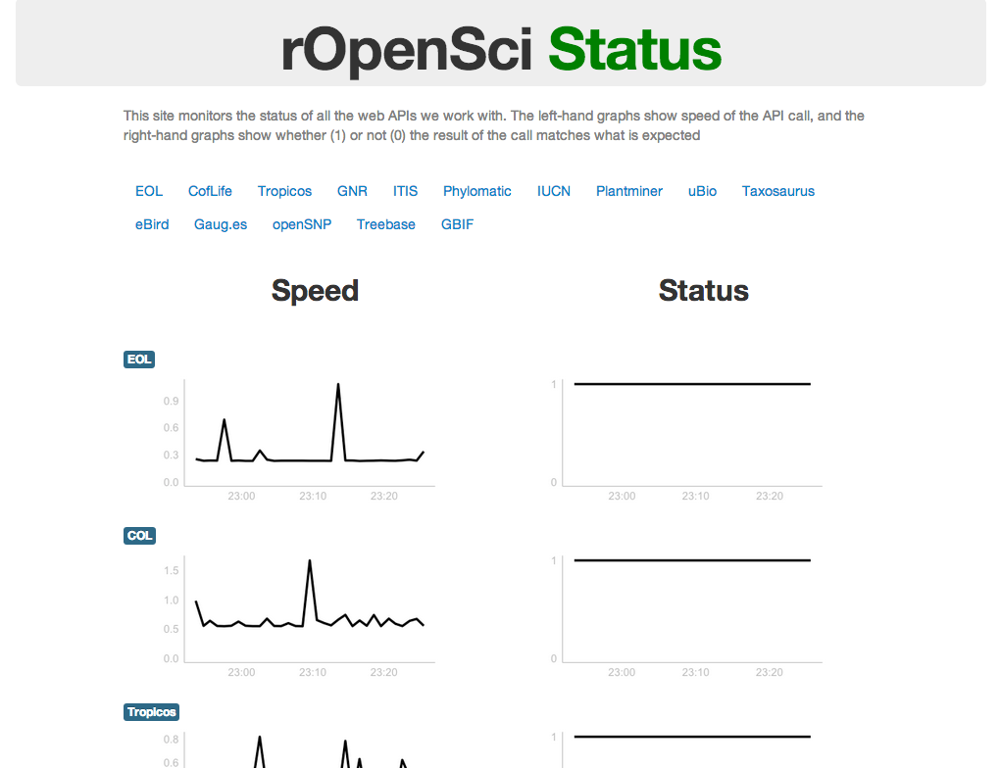

ropensci dashboard 
=======

`cronjob.txt` is a cron job file I use with `launchy` app on the CLI to run the R file `pingapis.r`, which sends data to the SQL database table `rodb`. The Shiny app including `ui.r` and `server.r` polls the `rodb` database table for changes. 

Screenshot of what the app looks like:

